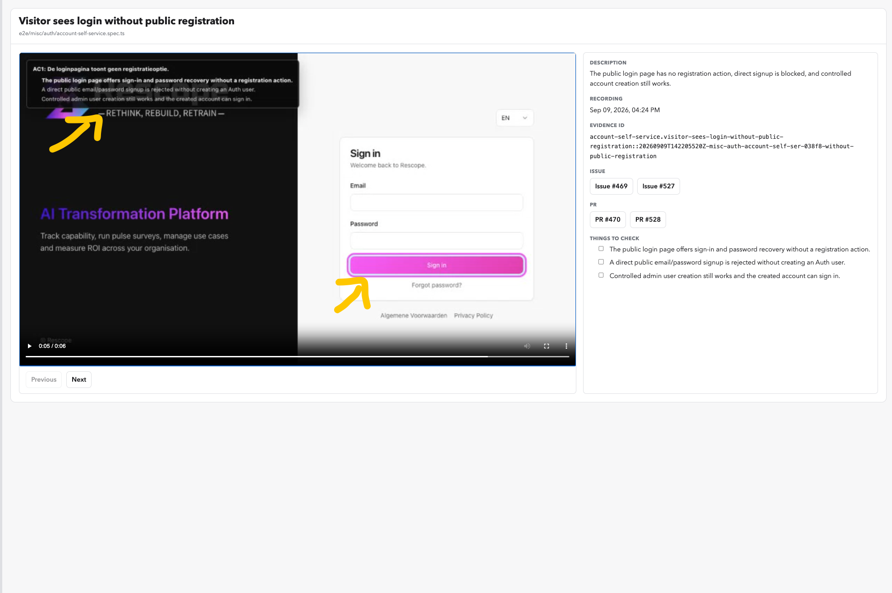

# Playwright Video Skill

Teach your coding agent to record short, clear videos of a web app.

- Show each step at a readable pace.
- Check the result before showing a checkpoint.
- Add a small checklist and highlight what matters.
- Save a WebM video and a Playwright report.

Works with any web app. No cloud account or backend required.

## What it looks like



- **Checklist:** shows what the test checks and marks the current step.
- **Highlight:** points to the part of the page to look at.
- **Review panel:** gives the reviewer context, issue links, and things to check.

This example uses a separate video viewer. The skill provides the recording
and overlays; that viewer and its review panel are not included.

## Install

Clone this repo:

```sh
git clone https://github.com/vincentclaes/playwright-video-skill.git
```

Copy `skills/playwright-video` into your project's folder below:

| Agent | Folder | Docs |
| --- | --- | --- |
| Codex | `.agents/skills/` | [Setup](https://developers.openai.com/codex/skills/) |
| Claude Code | `.claude/skills/` | [Setup](https://code.claude.com/docs/en/skills) |
| Cursor | `.cursor/skills/` | [Setup](https://cursor.com/docs/skills) |
| GitHub Copilot | `.github/skills/` | [Setup](https://docs.github.com/en/copilot/how-tos/copilot-on-github/customize-copilot/customize-cloud-agent/add-skills) |

For example, run this from your app's folder, adjusting the source path:

```sh
mkdir -p .agents/skills
cp -R /path/to/playwright-video-skill/skills/playwright-video .agents/skills/
```

Reload your agent if needed. Other agents can read `SKILL.md` directly.

## Use

Ask your agent:

> Use the playwright-video skill to record the checkout flow on localhost.
> Show the cart total, place a test order, and check the confirmation.

Your agent needs terminal access, Playwright, and a browser. It uses your app's
existing tests and setup. Use test accounts and safe sample data.

## Try the demo

From this repo, with Node.js 22 or newer:

```sh
npm ci
npx playwright install chromium
npm test
npm run report
```

No app server is needed. Add `-- --headed` to `npm test` to watch the browser.
Videos are in `test-results/`; the report is in `playwright-report/`.
Each run replaces those folders, so copy recordings you want to keep.

## What's inside

[The skill](skills/playwright-video/SKILL.md), a reusable checkpoint helper,
and a working example. Recordings stay local unless you ask to share them.
Playwright records the web page, not your whole desktop or microphone.

Recording uses [Playwright's built-in video support](https://playwright.dev/docs/videos).
