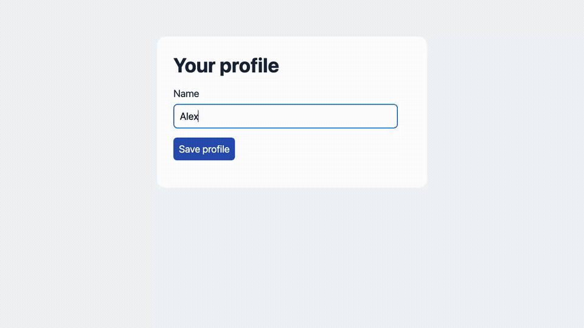

# Playwright Video Skill

Teach your coding agent to record short, clear videos of a web app.

- Show each step at a readable pace.
- Check the result before showing a checkpoint.
- Add a small checklist and highlight what matters.
- Save a WebM video and a Playwright report.

Works with any web app. No cloud account or backend required.

## Demo video



[Watch or download the full video](docs/videos/demo.webm).

## Install

- Clone this repo:

```sh
git clone https://github.com/vincentclaes/playwright-video-skill.git
```

- Copy `skills/playwright-video` into your app's agent folder below.
- Reload your agent if needed.

## Agents

- [Codex](https://developers.openai.com/codex/skills/): `.agents/skills/`
- [Claude Code](https://code.claude.com/docs/en/skills): `.claude/skills/`
- [Cursor](https://cursor.com/docs/skills): `.cursor/skills/`
- [GitHub Copilot](https://docs.github.com/en/copilot/how-tos/copilot-on-github/customize-copilot/customize-cloud-agent/add-skills): `.github/skills/`
- Other agents: ask them to read `skills/playwright-video/SKILL.md`.

## Use

- Needs terminal access, Playwright, and a browser.
- Use test accounts and sample data.
- Tell your agent what to record and check:

> Use playwright-video to record checkout on localhost. Check the total and order confirmation.

## Try the demo

From this repo, with Node.js 22 or newer:

```sh
npm ci
npx playwright install chromium
npm test
npm run report
```

No app server is needed. Add `-- --headed` to `npm test` to watch the browser.
Videos are in `test-results/`; the report is in `playwright-report/`.
Each run replaces those folders, so copy recordings you want to keep.

## What's inside

[The skill](skills/playwright-video/SKILL.md), a reusable checkpoint helper,
and a working example. Recordings stay local unless you ask to share them.
Playwright records the web page, not your whole desktop or microphone.

Recording uses [Playwright's built-in video support](https://playwright.dev/docs/videos).
